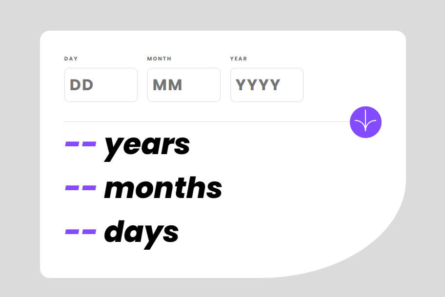

# Frontend Mentor - Age calculator app solution

This is a solution to the [Age calculator app challenge on Frontend Mentor](https://www.frontendmentor.io/challenges/age-calculator-app-dF9DFFpj-Q). Frontend Mentor challenges help you improve your coding skills by building realistic projects.

## Overview

### The challenge

Users should be able to:

- View an age in years, months, and days after submitting a valid date through the form
- Receive validation errors if:
  - Any field is empty when the form is submitted
  - The day number is not between 1-31
  - The month number is not between 1-12
  - The year is in the future
  - The date is invalid e.g. 31/04/1991 (there are 30 days in April)
- View the optimal layout for the interface depending on their device's screen size
- See hover and focus states for all interactive elements on the page
- **Bonus**: See the age numbers animate to their final number when the form is submitted

### Screenshot



## My process

### Built with

- Semantic HTML5 markup
- CSS custom properties
- Flexbox
- CSS Grid
- Mobile-first workflow

### What I learned

I learned how to use different cases whit reapeting structures and best ways to implement the clean code concept in functions.

To see how you can add code snippets, see below:

```html
<h1>Some HTML code I'm proud of</h1>
```
```css
.proud-of-this-css {
  color: papayawhip;
}
```
```js
const proudOfThisFunc = () => {
  console.log('🎉')
}
```

## Author

- Frontend Mentor - [@Irwing-Dev](https://www.frontendmentor.io/profile/Irwing-Dev)
- Github - [@Irwing-Dev](https://www.github.com/Irwing-Dev )

## Acknowledgments

The code of this project is inspired by a professional programmer that i watch and he show how to make the challenge. I pratically use ctrl+c and ctrl+v in your repository, because after many attempts, Whenever i came up a result, some other part was a problem, making me lose again. But i really liked this project, i want to use it in the future in some other project, study it better and be able to create code like this in the future.